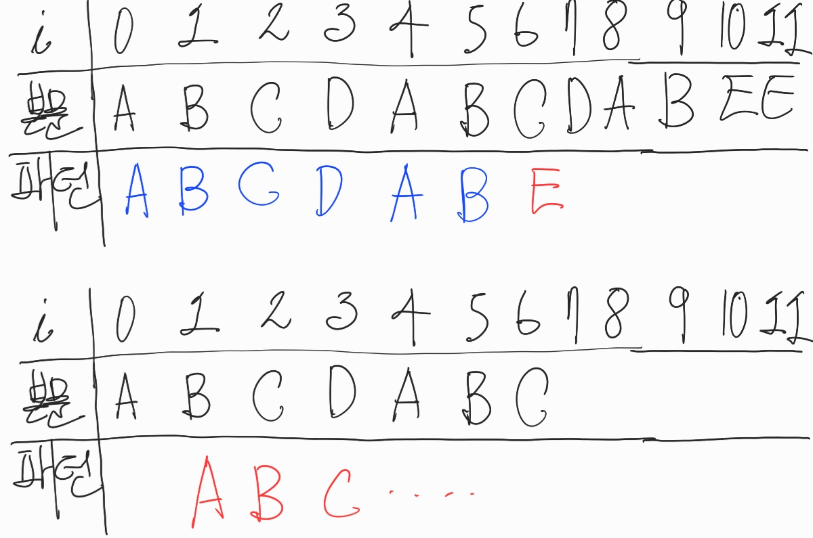
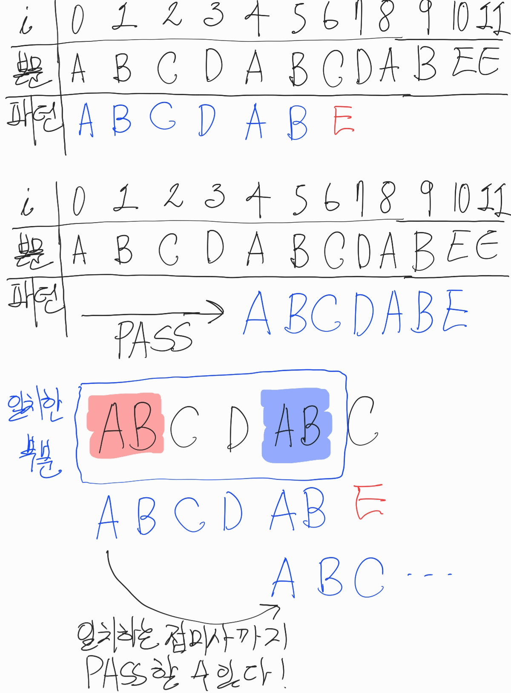
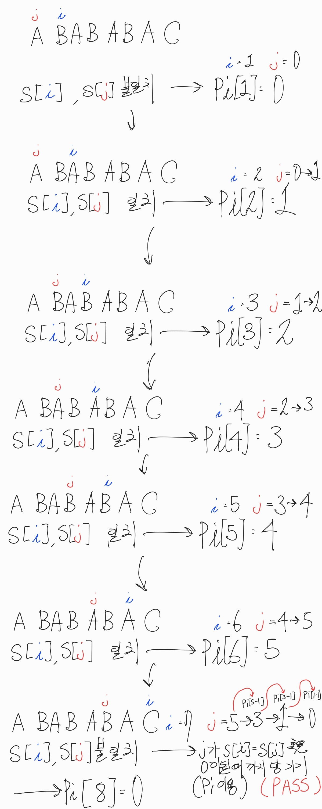

# String

## KMP

- Created: May 12, 2021 9:21 PM
- Created By: 재욱 이
- Last Edited Time: May 30, 2021 10:05 PM
- Participants: 재욱 이
- Type: 알고리즘 정리 (자율)

[KMP : 문자열 검색 알고리즘](https://bowbowbow.tistory.com/6)

- 문자열 검색 알고리즘
- 본문 내에서 특정 패턴의 문자열을 찾는 것.

- 본문 길이를 n, 패턴 길이를 m이라 할때,

  - 단순 문자열 탐색 : $O(nm)$
  - KMP : $O(n + m)$

- 사전용어

  - Prefix / Suffix

    - Prefix : 접두사

      - 문자열 앞쪽의 부분문자열
      - ex) banana ⇒ b, ba, ban ...

    - Suffix : 접미사
      - 문자열 뒤쪽의 부분문자열
      - ex) banana ⇒ a, na, ana ...

  - pi 배열

    - `pi[i]` : 주어진 문자열의 `str[0~i]`의 부분문자열에서 접두사와 접미사가 같아질때의 접두, 접미사 중 가장 긴 것의 길이.
    - `if(prefix == suffix) : pi[i] = len(prefix)`

    - 이때, 접두,접미사는 `pi[0~i]`와 같아선 안된다.

    - ex) ABAABAB의 `pi[5]`는?
      - `str[0~5]` = ABAABA
      - 접두사 A, 접미사 A가 같음, `pi[5]` = len('A') = 1
      - 다음 접두사 AB, 접미사 AB가 다름, PASS
      - 다음 접두사 ABA, 접미사 ABA가 같음, `pi[5]` = len('ABA') = 3
      - 이후론 같은 접두, 접미사가 없으므로 `pi[5]` = 3
    - ex2) ABAABAB의 전체 pi 배열
      | index | substring | pi[i] |
      |------- |:-----------: |------- |
      | 0 | A | 0 |
      | 1 | AB | 0 |
      | 2 | ABA  | 1 |
      | 3 | ABAA  | 1 |
      | 4 |  ABAAB | 2 |
      | 5 |  ABAABA | 3 |
      | 6 |  ABAABAB | 2 |

- 단순 문자열 탐색 시,

  - 그림
    

  - 문자하나하나를 1대1 비교후,
  - 패턴이 일치하거나 불일치할경우 다음 index로 옮겨감
  - 그러면서 다시 1대1 비교
  - 비효율적, 다음 index로 옮겨가면서 정보가 유실됨
    - 그림의 경우, `str[0~5]`까지는 일치한다는 사실의 정보가 유실되고 있음!
  - KMP는 이러한 정보를 이용해 효율적으로 탐색하는 알고리즘

- KMP

  - [C++ Code](kmp.cpp)
  - 그림
    

  - 패턴과 불일치한 문자가 발견될 경우,
  - 패턴과 일치하는 부분의, 접두사와 일치하는 접미사의 index까지 패턴비교를 pass할 수 있다.
  - 이때 pi 배열 활용
  - 단순 문자열 탐색에 비해 중간과정이 많이 생략된다!

- `getPi` 함수

  - pi배열을 활용하므로 pi배열을 얻을 수 있어야 한다.
  - 단순한 방법으론 오래 걸리기에 여기에도 KMP의 원리를 적용한다.
  - $O(m^3)$ vs $O(m)$
  - [C++ Code](get_pi.cpp)

  - 기본 과정

    1. `pi` 배열을 0으로 초기화 합니다.
    2. `j`를 0, `i`를 1로 두고 시작합니다.
    3. `str[i]` 와 `str[j]`가 일치할 때까지 `i`를 증가 시킵니다.
    4. 불일치하여 `i`가 증가할 동안, `pi[i]`는 초기값 0으로 그대로 남습니다.
    5. 일치하면, 불일치 할때 까지 `i`와 `j`를 1씩 증가시킵니다.
    6. 증가할 동안, `pi[i]`에는 `j + 1`이 저장됩니다.
    7. 불일치하면, `str[i]`와 `str[j]`가 일치하거나 `j`가 0이 될때까지 `j`를 앞으로 당깁니다.
    8. 이때 1씩 `j`를 감소시키면 비효율적이므로, kmp의 원리를 이용, `pi`배열을 이용합니다. `j = pi[j - 1]` 의 과정을 7번의 조건에 맞을때 까지 반복합니다.
    9. 일치해서 반복을 탈출하면, `pi[i]`에는 `j + 1`이 저장되고, `j`가 0이 되서 탈출하면 `pi[i]`는 초기값 0으로 그대로 남습니다.
    10. 3번에서 9번까지의 과정을 `i`가 문자열 크기가 될때까지 반복합니다.

  - 그림

    

  - 개인적으로 위의 KMP보다 이해하기 더 어려웠다...

- 관련문제
  - [18109\_도깨비불](https://www.acmicpc.net/problem/18109)
  - [1786\_찾기](https://www.acmicpc.net/problem/1786)
